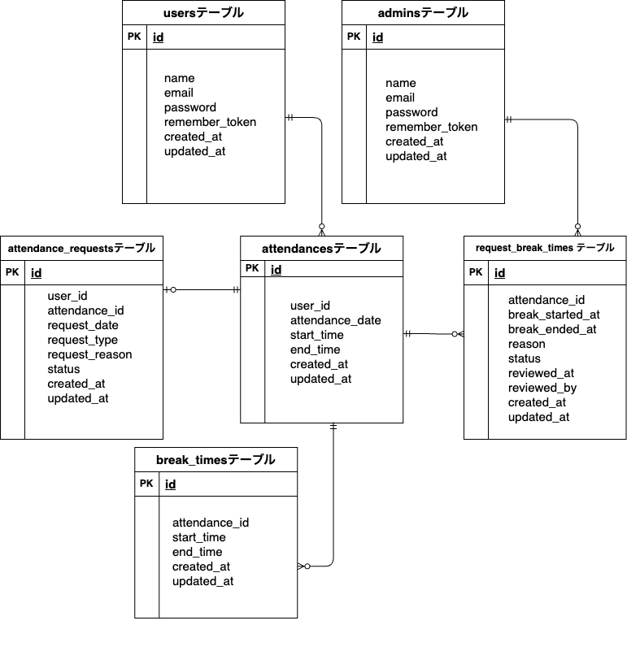

# 勤怠管理アプリ

## 環境構築  

### 画像取り扱いについて  

- 画像は `storage/app/public/images` に保存されています。  
- 画像をブラウザからアクセスするために、`php artisan storage:link`コマンドを実行してから`php artisan migrate --seed`を実行してください。 

### テストユーザー（ダミーユーザー）情報  

本アプリには、確認用の固定アカウントを用意しています。  
以下のメールアドレスとパスワードでログインしてください。  

1. 固定管理者名：管理者 太郎（メール認証済み）  
- メールアドレス：admin@example.com  
- パスワード：admin123  
  
2. 固定ユーザー：一般ユーザー 太郎(メール認証済み)  
- メールアドレス：user@example.com  
- パスワード：password123  
  
※ 上記アカウントは、php artisan migrate:fresh --seed を実行した場合に再作成されます。パスワードは暗号化（ハッシュ化）されていますが、上記で記載した平文パスワードでログイン可能です。    

### メール認証について  
- 登録後、自動でメール認証画面に遷移します。
- メール送信の確認には MailHog というツールを使用しています。
- MailHog は docker-compose で自動的に起動します。追加の設定や会員登録は不要です。
- MailHog を起動した状態で、ブラウザから [http://localhost:8025](http://localhost:8025) にアクセスすると送信されたメールを確認できます。

### Dockerビルド
1. git clone https://github.com/morikoshi2627/KintaiApp.git  
2. cd KintaiApp  
3. docker-compose build  
4. docker-compose up -d  
5. docker-compose exec php bash  

### Laravel環境構築
1. composer install  
2. cp .env.example .env  
3. php artisan key:generate  
4. `.env`のDB設定を以下のように修正  

    DB_CONNECTION=mysql  
    DB_HOST=mysql  
    DB_PORT=3306  
    DB_DATABASE=KintaiApp_db  
    DB_USERNAME=KintaiApp_user  
    DB_PASSWORD=KintaiApp_pass  

5. `.env`に下記のメール認証設定を追記してください（Mailhog使用） 

    MAIL_MAILER=smtp
    MAIL_HOST=mailhog
    MAIL_PORT=1025
    MAIL_USERNAME=null
    MAIL_PASSWORD=null
    MAIL_ENCRYPTION=null
    MAIL_FROM_ADDRESS=test@example.com
    MAIL_FROM_NAME="KintaiApp"

6. ストレージリンクを作成（画像表示のため）  
    php artisan storage:link  

7. データベースを初期化（マイグレーション＋シーディング）  
    php artisan migrate --seed  

### 開発環境
- 管理者ログイン画面: http://localhost/admin/login  
- 一般ユーザー会員登録画面： http://localhost/register/   
- メール確認用（Mailhog）： http://localhost:8025/  
- 管理ツール（phpMyAdmin）： http://localhost:8080/  
  - ユーザー名: `KintaiApp_user`  
  - パスワード: `KintaiApp_pass`  

### 使用技術（実行環境）  
- Laravel 8.83.29  
  - Laravel Fortify（認証機能）
  - Laravel FormRequest(バリデーション機能)
- php:8.1-fpm  
- MySQL 8.0.26  
- Docker / Docker Compose  
- Mailhog（メール確認用）: http://localhost:8025/  
 
### ER図  
  
